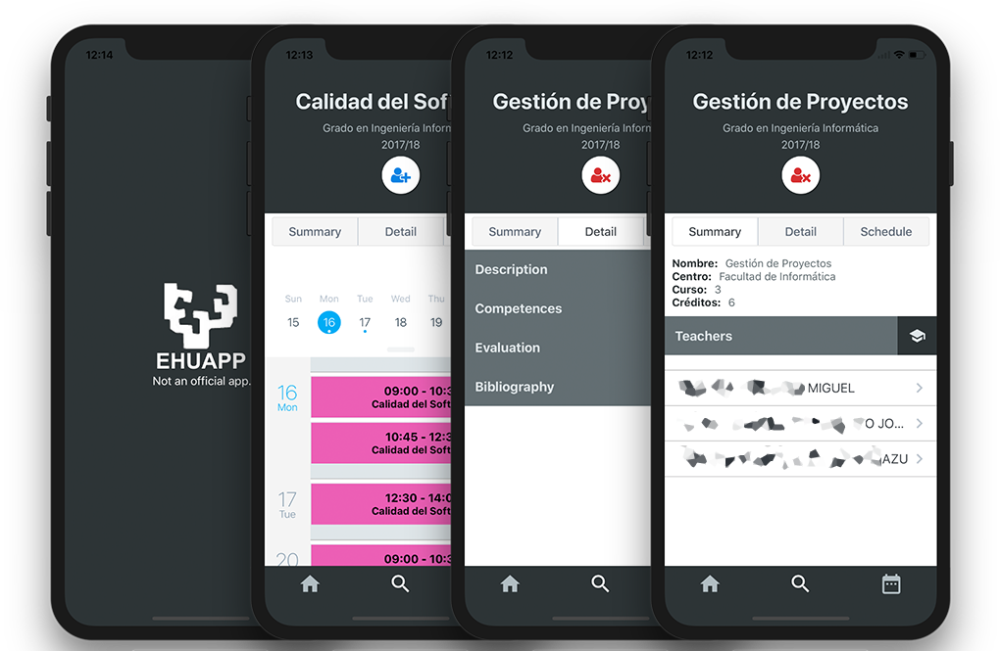

<h1 align="center"> EHUApp </h1>  

 

 🗓 Aplicación móvil para consultar y personalizar los horarios y calendarios de la universidad UPV-EHU

 

  

## Indice

1. [Instalación](#instalación)
2. [Funcionalidades](#funcionalidades)
3. [Tests](#tests)
4. [Contribución](#contribución)
5. [Autores](#autores)
6. [Licencia](#licencia)

## Instalación

Para consultar la información de forma más detallada se recomienda acudir a la guía de [React Native](https://facebook.github.io/react-native/docs/getting-started.html).

- Clonar o descargar el repositorio.
- `yarn` o `npm install` para instalar las depencias.
- `yarn run start` o `npm run start`
- `yarn run android`, `yarn run ios`, `npm run android` o `npm run ios` ** Probar la versión iOS require un Mac.

## Funcionalidades

Estás son algunas de las funcionalidades más destacadas:

* Consultar horarios de asignaturas y tutorias.
* Subscribirse a las asignaturas y profesores.
* Consultar un horario personalizado.
* Ver la información referente a cada asignatura.

## Tests
Las pruebas se han realizado utilizando las herramientas [Jest](https://facebook.github.io/jest/) y [Enzyme](https://github.com/airbnb/enzyme).
Para más información consultar el artículo sobre los tests que se encuentra en la [wiki](https://github.com/jcarral/EHUApp/wiki).

## Contribución

Por favor, ve al fichero [CONTRIBUTING.md](CONTRIBUTING.md) para leer con detalle como contribuir al proyecto.

## Autores

* **Joseba Carral** - *Autor* - [jcarral](https://github.com/jcarral)

## Licencia
Esta librería está bajo la licencia [MIT](./LICENSE.md)
