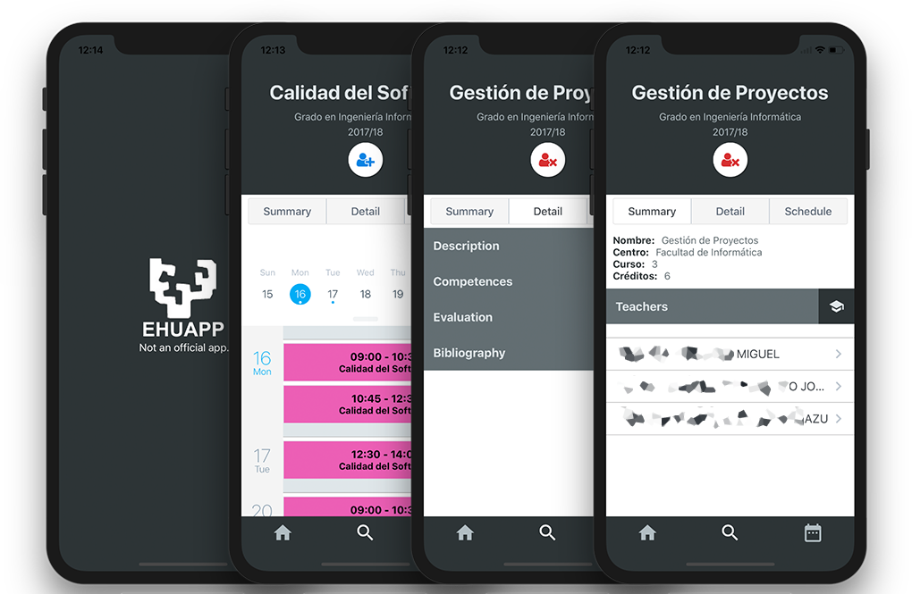

<h1 align="center"> EHUApp </h1>  

 

 🗓 Aplicación móvil para consultar y personalizar los horarios y calendarios de la universidad UPV-EHU

 

  

## Indice

- [Funcionalidades](#funcionalidades)
- [Instalacion](#instalacion)

## Funcionalidades

Estás son algunas de las funcionalidades más destacadas:

* Consultar horarios de asignaturas y tutorias.
* Subscribirse a las asignaturas y profesores.
* Consultar un horario personalizado.
* Ver la información referente a cada asignatura.

## Instalación

Para consultar la información de forma más detallada se recomienda acudir a la guía de [React Native](https://facebook.github.io/react-native/docs/getting-started.html).

- Clonar o descargar el repositorio.
- `yarn` o `npm install` para instalar las depencias.
- `yarn run start` o `npm run start`
- `yarn run android`, `yarn run ios`, `npm run android` o `npm run ios` ** Para probar la versión iOS se require un Mac.

